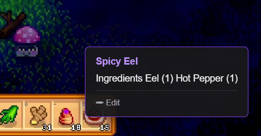
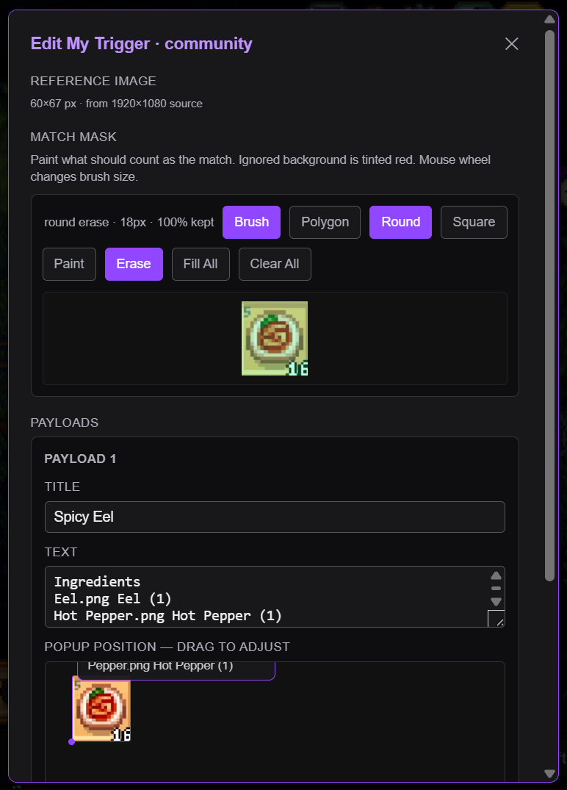

   
  <h1>Stream Genie</h1>
  
<strong>A living wiki, built into the stream.</strong>

  
Hover over anything in the video. A popup tells you what it is — without leaving the page.

---

## What is this?

Stream Genie is a Chrome extension that reads pixels from a Twitch stream and shows community-built annotations when you hover over recognized items. No streamer setup required. No game API. It runs entirely in your browser.

Think of it like Steam's controller profiles — Stream Genie is the framework. The community builds the knowledge, one game at a time.

## Install

> **Chrome Web Store listing coming soon.** For now, sideload it:

1. Download **[stream-genie-v0.9.zip](https://github.com/frothydv/streamGenie/releases/latest)** and unzip it anywhere.
2. Open Chrome → `chrome://extensions/` → enable **Developer mode** (top-right toggle).
3. Click **Load unpacked** → select the unzipped `extension/` folder.
4. The Stream Genie lamp icon appears in your toolbar.

## How it works

1. Open any Twitch stream. Stream Genie detects the game from the Twitch category.
2. Click the toolbar icon to select a community profile for that game.
3. Hover over items in the video — cards, relics, icons, anything the community has annotated.
4. A popup appears near your cursor. Move away and it disappears.

Matching is done locally in your browser using perceptual image hashing. Nothing is sent to a server during normal use.

## Permissions

Stream Genie requests the minimum permissions required to function.

| Permission | Why it's needed |
|---|---|
| `activeTab` | Detect which game you're watching |
| `storage` | Save profile selections and first-run state |
| `https://*.twitch.tv/*` | Run the hover overlay on Twitch pages |
| `https://raw.githubusercontent.com/*` | Download community annotation profiles |
| `https://cdn.jsdelivr.net/*` | Fetch the game catalog |
| `https://*.workers.dev/*` | Submit new trigger contributions |

## Contributing triggers

Anyone can add annotations. No setup beyond a GitHub account.

1. While watching a stream, press **Alt+Shift+C** (or click **+ Contribute a Trigger** in the popup).
2. The frame freezes. Drag a box around the thing you want to annotate.
3. Fill in the title and description. Click **Submit to Profile**.

Your submission goes to [streamGenieProfiles](https://github.com/frothydv/streamGenieProfiles) as a pull request. The profile owner reviews and merges it. Once merged, all viewers see your annotation automatically.

**Trusted contributors** (given a contributor code by the profile owner) skip the PR step and commit directly.

> **Heads up:** submissions are public. Your reference image crop and description text become part of a public GitHub repository. See the [privacy policy](https://frothydv.github.io/streamGenie/privacy) for details.

## For streamers and game developers

Want your viewers to have instant context while watching?

- **Profile owners** create and manage profiles for their game. Creating a profile gives you a contributor code to share with trusted contributors.
- **Streamers** can declare a default profile for their channel — viewers who install Stream Genie get your preferred profile automatically (config in the profiles repo).
- Community PRs appear at [streamGenieProfiles/pulls](https://github.com/frothydv/streamGenieProfiles/pulls) for you to review and merge.

## Supported games

Stream Genie works with any game once a community profile exists. Profiles live in [streamGenieProfiles](https://github.com/frothydv/streamGenieProfiles). Open a PR or create a profile from the extension popup to start one for your game.

| Game | Profile | Status |
|------|---------|--------|
| Slay the Spire 2 | community | Active |

## Known limitations

- **Resolution:** Best at 1080p. Small elements may miss at 720p; most small elements skip at 480p and below.
- **Cache:** Profiles cache for 2 minutes. New contributions may take up to 2 minutes to appear.
- **Browser:** Chrome only. Firefox planned post-beta.

## Contributing to the extension

Issues and PRs welcome on this repo. No build step — edit files, reload the extension at `chrome://extensions/`, done.
